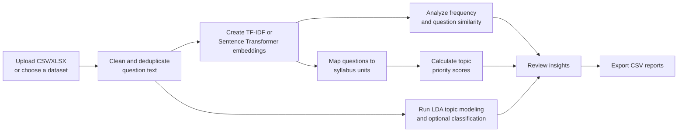

<div align="center">

# PYQ-Based Important Topic Recommender

**An NLP-powered Streamlit app that turns previous-year questions into focused exam-preparation insights.**

Analyze recurring topics, find semantically similar questions, map questions to syllabus units, and export a prioritized revision plan.

[](https://pyq-nlp-important-topic-recommender-nx8e4amvukjsgdexrkxkjt.streamlit.app/)
[](https://colab.research.google.com/drive/1W-I4clBMZvDk71wsMNifWWO32nQyUVaw?usp=sharing)


</div>

> [!IMPORTANT]
> This project does **not** predict an exact future exam paper. It recommends high-priority topics using historical question frequency, semantic similarity, and syllabus relevance.

## Overview

Preparing from a large collection of previous-year questions (PYQs) can make it difficult to see which concepts deserve the most attention. This project provides a single interactive workflow for exploring those questions and converting them into actionable revision priorities.

You can upload your own CSV or Excel file, load the GATE CSE Question Classification Dataset from Kaggle, or try the built-in sample dataset.

## What the app can do

- Clean and normalize question text automatically
- Detect likely question and topic columns in an uploaded dataset
- Compare questions using Sentence Transformer embeddings
- Fall back to TF-IDF when the transformer model is unavailable
- Display topic frequencies and recurring patterns
- Map questions to editable syllabus units using cosine similarity
- Rank syllabus units with an explainable priority score
- Retrieve the most similar PYQs for a new question
- Discover latent themes with LDA topic modeling
- Train a TF-IDF + Logistic Regression topic classifier when enough labeled data is available
- Generate a concise exam-preparation summary
- Export mapped questions and topic-priority reports as CSV files

## How it works



The recommendation score for each mapped syllabus unit is:

```text
priority score = number of mapped questions × average mapping similarity
```

A higher score suggests that the unit appears often in the supplied PYQs and is strongly aligned with the syllabus description.

## Try it

### Live Streamlit app

Open the [deployed application](https://pyq-nlp-important-topic-recommender-nx8e4amvukjsgdexrkxkjt.streamlit.app/).

> Streamlit Community Cloud may put an inactive app to sleep. If prompted, select **Yes, get this app back up!** and allow a short time for it to start.

### Google Colab

Open the [project notebook in Google Colab](https://colab.research.google.com/drive/1W-I4clBMZvDk71wsMNifWWO32nQyUVaw?usp=sharing) to explore or run the project in a browser-based notebook environment.

## Dataset format

The app accepts `.csv` and `.xlsx` files. A labeled dataset with the following columns works best:

| question | topic |
| --- | --- |
| Explain deadlock prevention and avoidance. | Operating Systems |
| Discuss normalization and functional dependency. | Databases |

The app attempts to detect common alternatives such as `text`, `problem`, `subject`, `label`, `class`, and `category`. Extra columns such as `year`, `marks`, `unit`, or `subject` may also be included.

For classification, provide at least two topic labels with multiple examples per label. Larger, balanced datasets will produce more meaningful results.

## Run locally

### 1. Clone the repository

```bash
git clone https://github.com/kritika89898/pyq-nlp-important-topic-recommender.git
cd pyq-nlp-important-topic-recommender
```

### 2. Create and activate a virtual environment

```bash
python -m venv .venv
```

On Windows:

```bash
.venv\Scripts\activate
```

On macOS or Linux:

```bash
source .venv/bin/activate
```

### 3. Install the dependencies

```bash
pip install -r requirements.txt
```

### 4. Start the app

```bash
streamlit run app.py
```

Then open the local URL displayed in the terminal, usually `http://localhost:8501`.

## Using the app

1. Choose **Upload CSV/Excel**, **Use Kaggle Dataset**, or **Use Sample Dataset** in the sidebar.
2. Select **Sentence Transformer / BERT** for semantic embeddings or **TF-IDF** for a lightweight option.
3. Review the detected columns, dataset preview, and topic-frequency chart.
4. Edit the syllabus definitions if your course differs from the built-in GATE CSE-style syllabus.
5. Explore mapped units, priority scores, similar questions, discovered topics, and classification results.
6. Download the mapped PYQ report and important-topic report as CSV files.

The Sentence Transformer model (`all-MiniLM-L6-v2`) is downloaded on first use, so the initial analysis can take longer.

## NLP and machine-learning pipeline

| Task | Method |
| --- | --- |
| Text preparation | Lowercasing, character cleanup, whitespace normalization, deduplication |
| Semantic representation | `all-MiniLM-L6-v2` Sentence Transformer |
| Lightweight fallback | TF-IDF with English stop-word removal |
| Similar-question retrieval | Cosine similarity |
| Syllabus mapping | Highest embedding similarity to a syllabus-unit description |
| Topic discovery | CountVectorizer + Latent Dirichlet Allocation |
| Topic classification | TF-IDF + Logistic Regression |
| Evaluation | Stratified train/test split and accuracy score |

## Built-in syllabus areas

The default syllabus covers:

- Programming & Data Structures
- Algorithms
- Operating Systems
- Databases
- Computer Networks
- Theory of Computation
- Computer Organization
- Digital Logic
- Compiler Design
- Mathematics

Every area and its keyword description can be edited directly in the app.

## Project structure

```text
pyq-nlp-important-topic-recommender/
├── app.py              # Streamlit interface and NLP pipeline
├── requirements.txt    # Python dependencies
└── README.md           # Project documentation
```

## Tech stack

- Python
- Streamlit
- pandas and NumPy
- scikit-learn
- Sentence Transformers
- KaggleHub
- OpenPyXL

## Limitations

- Recommendations reflect patterns in the supplied historical dataset; incomplete or biased data will affect the ranking.
- A high-priority score indicates repetition and syllabus similarity, not certainty that a topic will appear in a future exam.
- Automatic column detection and syllabus mapping may require manual review.
- Classification is skipped when the dataset has too few labeled examples.
- Transformer embeddings may be slower on the first run because the model must be downloaded.

## Possible improvements

- Add year- and marks-based weighting
- Show trend changes across exam sessions
- Support multilingual questions
- Add richer evaluation metrics and confusion matrices
- Save reusable syllabus templates
- Provide explanations for individual recommendations

---

<div align="center">

Built to make PYQ analysis more structured, explainable, and useful for revision.

[Live Demo](https://pyq-nlp-important-topic-recommender-nx8e4amvukjsgdexrkxkjt.streamlit.app/) · [Google Colab](https://colab.research.google.com/drive/1W-I4clBMZvDk71wsMNifWWO32nQyUVaw?usp=sharing) · [Repository](https://github.com/kritika89898/pyq-nlp-important-topic-recommender)

</div>
